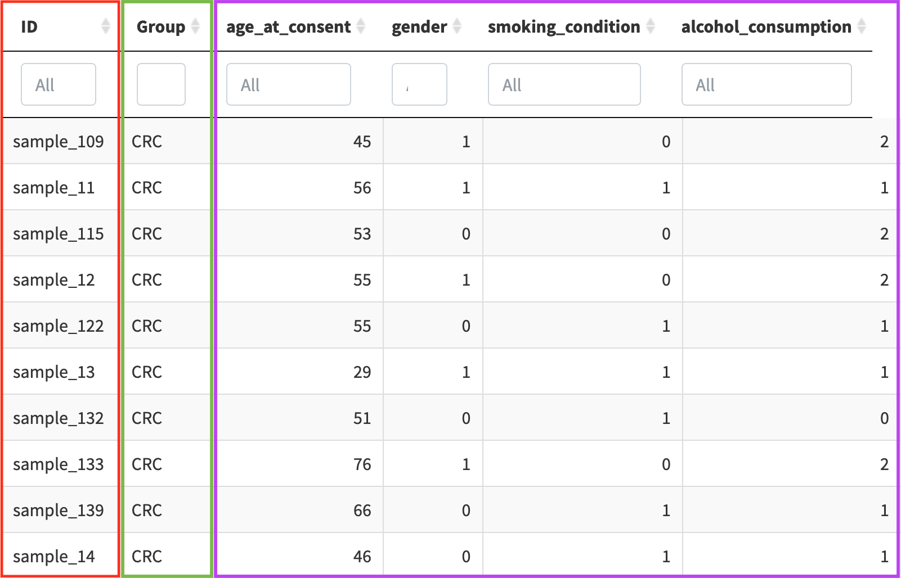
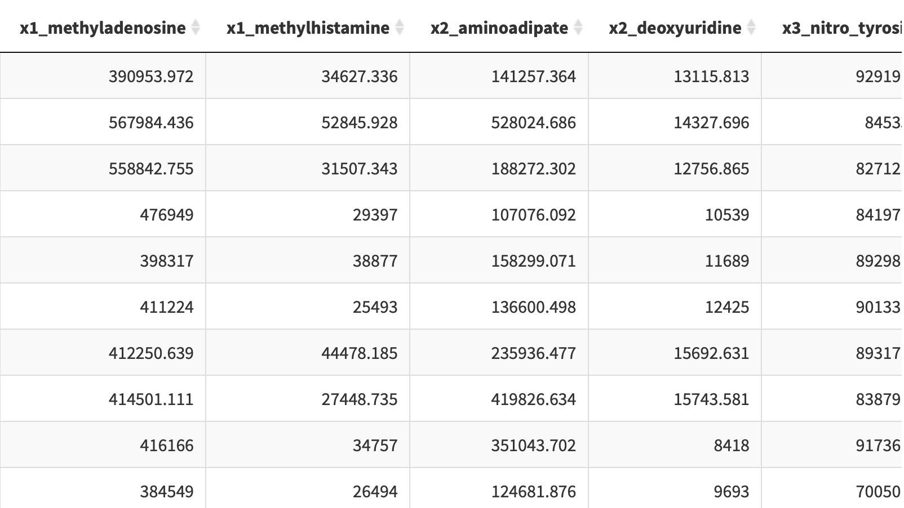
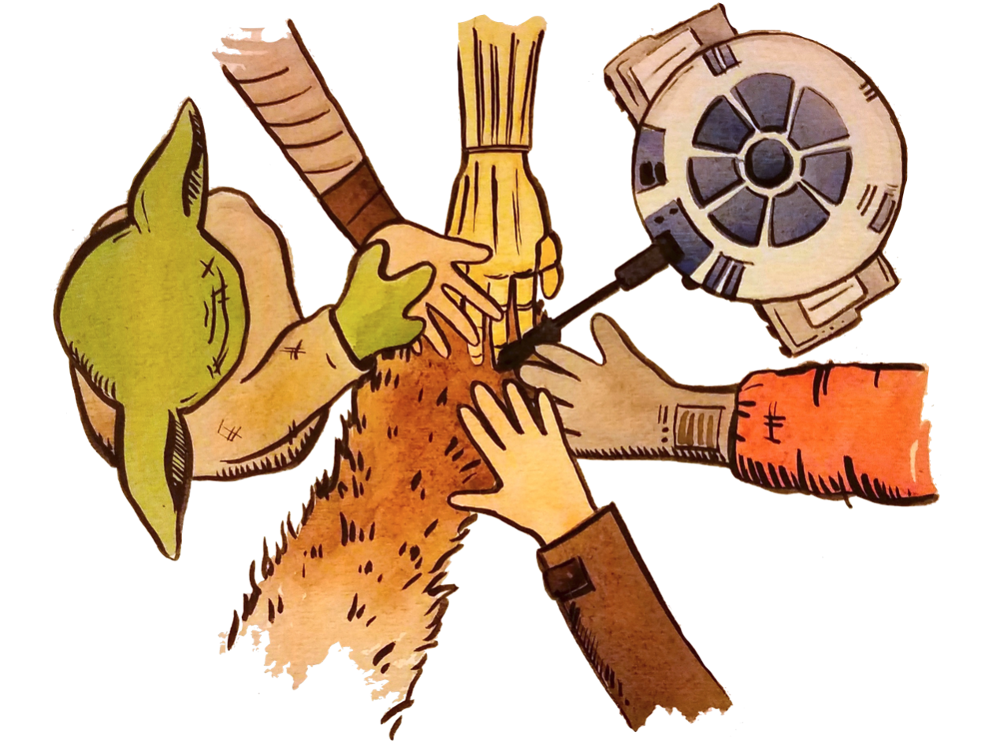

```{r setup, include = FALSE}
stopifnot(require(htmltools))
stopifnot(require(knitr))
library(tidyverse)
```

```{r htmltools, include = FALSE}
htmltools::tagList(rmarkdown::html_dependency_font_awesome())

opts_chunk$set(warning = FALSE, message = FALSE, 
               comment = "#>", fig.path = 'img/', fig.align = 'center', 
               fig.height = 8.5, out.width = '100%', fig.show = 'hold', 
               fig.retina = 3, cache = FALSE, cache.path = 'cache/')
```

# Scope

.center[

### `POMA` focuses on <u>**statistical analysis**</u> of omics data

]

--

  1) Directly from sheet (xlsx, csv, etc.) &#10060;&#10060;
  
--
  
  2) Extract quantitative data from Bioconductor objects (`MSnSet`, `QFeatures`, `SummarizedExperiment`, etc.) and format it &#10060;

.footnote2[

Laurent Gatto, Omics Data Analysis; Chapter 8. [[Book]](https://uclouvain-cbio.github.io/WSBIM2122/sec-prot.html) </br>
Computational Biology Reading Group, Session 8. [[Project]](https://github.com/dukecct/CBRG/blob/main/inst/projects/08_project.Rmd) [[Slides]](https://github.com/dukecct/CBRG/blob/main/inst/slides/08_slides.Rmd) </br> 
Images by Allison Horst. [[GitHub]](https://github.com/allisonhorst) [_@allison_horst_](https://twitter.com/allison_horst)

]

--

  3) Use Bioconductor objects directly (++ reproducibility and interoperability) &#9989;
  
.center[


]

---

# Data formatting

.center[

### Input required in all `POMA` functions is a `SummarizedExperiment` object

]

.pull-left[

**Target** - `colData()`



]

.pull-right[

**Features** - `assay()`



]

<br>

```{r, eval = FALSE}
# create SummarizedExperiment object from data frames
my_sum_exp <- PomaSummarizedExperiment(target = "target", 
                                       features = "features")
```

---

# Pre-processing...

.center[

### `POMA` pre-processing functions return a pre-processed `SummarizedExperiment` object

]

--

## Missing value imputation

```{r, eval = FALSE}
my_sum_exp %>% 
  PomaImpute(ZerosAsNA = FALSE, # treat zeros as zeros
             RemoveNA = TRUE, # remove features with...
             cutoff = 20, # more than 20% of NAs
             method = "knn") # up to 6 methods here!
```

--

## Normalization

```{r, eval = FALSE}
my_sum_exp %>% 
  PomaNorm(method = "log_scaling") # up to 6 methods here!
```

---

# Some more pre-processing...

## Outlier detection and cleaning

.pull-left[

**Detection**:

```{r, eval = FALSE}
my_sum_exp %>% 
  {{PomaOutliers(do = "analyze")}}
```

Output:

```{r, echo = FALSE, warning = FALSE, comment = FALSE, message = FALSE, fig.height = 4}
library(POMA)
library(ggplot2)
library(patchwork)

my_sum_exp <- st000284 %>% 
  PomaNorm(method = "log_scaling") %>%
  PomaOutliers(do = "analyze")

my_sum_exp$polygon_plot + theme(legend.position = "top") | 
  my_sum_exp$distance_boxplot + theme(legend.position = "top")
```

]

.pull-right[

**Cleaning**:

```{r, eval = FALSE}
my_sum_exp %>% 
  {{PomaOutliers(do = "clean")}}
```

Output:

A "clean" `SummarizedExperiment` object (without sample outliers)

]

---

# `SummarizedExperiment` subsetting

```{r, echo = FALSE}
st000284 %>% 
  PomaImpute(method = "knn")
```

--

```{r, echo = FALSE}
clean_object <- st000284[, st000284$factors %in% c("CRC", "Healthy")]

clean_object <- clean_object %>% 
  PomaImpute(method = "knn") %>% 
  PomaNorm(method = "log_scaling") %>% 
  PomaOutliers(do = "clean")
```

```{r, eval = FALSE}
clean_object[, clean_object$group %in% c("CRC", "Healthy")] #<<
```

```{r, echo = FALSE}
clean_object
```

---

# Let's explore the data before stats!

## Samples

.pull-left[

```{r, warning = FALSE, comment = FALSE, message = FALSE, fig.height = 4}
clean_object %>%
  PomaBoxplots(group="samples", #<<
               label_size=5)
```

]

.pull-right[

```{r, warning = FALSE, comment = FALSE, message = FALSE, fig.height = 4}
clean_object %>%
  PomaDensity(group="samples") #<<
```

]

---

# Let's explore the data before stats!

## Features

.pull-left[

```{r, warning = FALSE, comment = FALSE, message = FALSE, fig.height = 4}
clean_object %>%
  PomaBoxplots(group="features", #<<
               label_size=5)
```

]

.pull-right[

```{r, warning = FALSE, comment = FALSE, message = FALSE, fig.height = 4}
clean_object %>%
  PomaDensity(group="features") #<<
```

]

---

# Features of interest

```{r, warning = FALSE, comment = FALSE, message = FALSE, fig.height = 3.4}
clean_object %>%
  PomaBoxplots(group = "features", 
               jitter = TRUE,
               legend_position = "right",
               feature_name = c("glyceraldehyde",
                                "lysine",
                                "linolenic_acid"))
```

---

# Heatmap (with `ComplexHeatmap`)

```{r, warning = FALSE, comment = FALSE, message = FALSE, fig.height = 4}
clean_object %>%
  PomaHeatmap()
```

---

# Adding more `colData` variables!

```{r, warning = FALSE, comment = FALSE, message = FALSE, echo = FALSE}
library(SummarizedExperiment)
target <- SummarizedExperiment::colData(clean_object) %>% 
  as.data.frame() %>% 
  dplyr::mutate_at(vars(c("gender", "smoking_condition", "alcohol_consumption")), ~ as.factor(.)) %>% 
  dplyr::mutate(age_at_consent = as.numeric(age_at_consent)) %>% 
  dplyr::rename(age = age_at_consent,
                smoking = smoking_condition, 
                alcohol = alcohol_consumption) %>% 
  tibble::rownames_to_column("ID") %>% 
  as.data.frame()
  
assay_p <- SummarizedExperiment::assay(clean_object) %>% 
  t()

clean_object3 <- POMA::PomaSummarizedExperiment(target, assay_p)
```

```{r, eval = FALSE}
clean_object %>%
  SummarizedExperiment::colData()
```

```{r, echo = FALSE}
clean_object3 %>%
  SummarizedExperiment::colData()
```

---

# Adding more `colData` variables!

```{r, warning = FALSE, comment = FALSE, message = FALSE, fig.height = 4, eval = FALSE}
clean_object %>%
  PomaHeatmap(cols = c(1, 3:5), #<<
              show_legend = FALSE)
```

```{r, warning = FALSE, comment = FALSE, message = FALSE, fig.height = 4, echo = FALSE}
clean_object3 %>%
  PomaHeatmap(cols = c(1, 3:5),
              show_legend = FALSE)
```

---

# Volcano plot

```{r, eval = FALSE}
clean_object %>%
    PomaVolcano(xlim = 2,
                log2FC = 0.5,
                labels = TRUE)
```

```{r, warning = FALSE, comment = FALSE, message = FALSE, fig.height = 4, echo = FALSE}
clean_object2 <- st000284[, st000284$factors %in% c("CRC", "Healthy")]

clean_object2 %>% 
  PomaImpute(method = "knn") %>%
  PomaOutliers(do = "clean") %>%
  PomaVolcano(xlim = 2,
              log2FC = 0.5,
              labels = TRUE)
```

---

# Finally, STATS!

  - **Univariate analysis:** T-test, ANOVA, ANCOVA, Wilcoxon test, and Kruskal Wallis

  - **Multivariate analysis:** PCA, PLS-DA, and sPLS-DA

  - **Cluster analysis:** _k_-means (so far...)

  - **Limma:** Both designs with and without covariates

  - **Correlation analysis:** Pairwise correlations, correlogram, network correlations and Gaussian Graphical Models

  - **Regularization methods:** LASSO, Ridge, and Elasticnet (**allowing external CV**)

  - **Random forest:** Classical Random forest algorithm (**allowing external CV**)

  - **Rank products:** From `RankProd` _Bioconductor_ package

  - **Odds ratios:** Based on a logistic regression model (two-group analysis)

---

# Simple & Compact

.center[

### `POMA` functions are focused on <u>**simplifying and compacting**</u> the analyses, grouping different methodologies of the same class within a single function instead of maintaining several "single purpose" functions

]

--

.pull-left[

**Univariate analysis: 1 function, 4 methods**

```{r, warning = FALSE, comment = FALSE, message = FALSE, eval = FALSE}
clean_object %>%
  
# parametric methods
PomaUnivariate(method = "ttest")

PomaUnivariate(method = "anova")

# non-parametric methods
PomaUnivariate(method = "mann")

PomaUnivariate(method = "kruskal")
```

]

--

.pull-right[

**Multivariate analysis: 1 function, 3 methods**

```{r, warning = FALSE, comment = FALSE, message = FALSE, eval = FALSE}
clean_object %>% 
  
PomaMultivariate(method = "pca")

PomaMultivariate(method = "plsda")

PomaMultivariate(method = "splsda")
```

]

---

# External cross-validation

.center[

### `POMA` predictive features allow users to split data into random _train_ and _test_ sets to perform an <u>**external cross-validation**</u> (CV)

]

--

.pull-left[

LASSO for **feature selection**: All data used to create the model and no _test_ set created 

```{r, warning = FALSE, comment = FALSE, message = FALSE, eval = FALSE}
clean_object %>%
  PomaLasso(alpha = 1, # LASSO
            ntest = NULL) #<<
```

Ridge regression for **predictive modeling**: External CV using the 20% of the data as _test_ set

```{r, warning = FALSE, comment = FALSE, message = FALSE, eval = FALSE}
clean_object %>%
  PomaLasso(alpha = 0, # Ridge
            ntest = 20) #<<
```

]

--

.pull-right[

Random forest for **predictive modeling**: External CV using the 20% of the data as _test_ set

```{r, warning = FALSE, comment = FALSE, message = FALSE, eval = TRUE, echo = FALSE}
rf_res <- clean_object %>% 
  PomaRandForest(ntree = 500,
                 ntest = 20)
```

```{r, warning = FALSE, comment = FALSE, message = FALSE, eval = FALSE}
clean_object %>%
  PomaRandForest(ntree = 500,
                 ntest = 20) #<<
```

```{r, warning = FALSE, comment = FALSE, message = FALSE, eval = TRUE, echo = FALSE}
rf_cf <- rf_res$confusion_matrix
rownames(rf_cf) <- c("CRC", "Healthy")
colnames(rf_cf) <- c("CRC", "Healthy", "Error") 
  
rf_cf %>% 
  dplyr::mutate(Error = round(Error, 2)) %>% 
  kableExtra::kbl(booktabs = TRUE, row.names = TRUE) %>%
  kableExtra::kable_styling(latex_options = c("striped", "scale_down"))
```

]

---

# Covariates

```{r, warning = FALSE, comment = FALSE, message = FALSE, echo = FALSE}
library(SummarizedExperiment)
target <- SummarizedExperiment::colData(clean_object) %>% 
  as.data.frame() %>% 
  dplyr::mutate_at(vars(c("gender", "smoking_condition", "alcohol_consumption")), ~ as.factor(.)) %>% 
  dplyr::mutate(age_at_consent = as.numeric(age_at_consent)) %>% 
  dplyr::rename(age = age_at_consent,
                smoking = smoking_condition, 
                alcohol = alcohol_consumption) %>% 
  tibble::rownames_to_column("ID") %>% 
  as.data.frame()
  
assay_p <- SummarizedExperiment::assay(clean_object) %>% 
  t()

clean_object <- POMA::PomaSummarizedExperiment(target, assay_p)
```

```{r}
clean_object %>%
  SummarizedExperiment::colData()
```

---

# Let's adjust!

<br>

## ANOVA/ANCOVA

```{r eval = FALSE}
clean_object %>%
  PomaUnivariate(method = "anova",
                 covariates = TRUE, 
                 covs = c("age", "gender"))
```

<br>

$$feature \sim \beta_0 + age + gender + group + \epsilon$$
---

# Let's adjust!

<br>

## Limma

```{r eval = FALSE}
clean_object %>%
  PomaLimma(contrast = "Healthy-CRC",
            covariates = TRUE, 
            covs = c("age", "smoking"))
```

<br>

$$feature \sim \beta_0 + group + age + smoking + \epsilon$$

---

# Let's adjust!

<br>

## Odds Ratios (logistic regression)

```{r eval = FALSE}
clean_object %>%
  PomaOddsRatio(covariates = TRUE, 
                covs = c("smoking", "alcohol", "age"))
```

<br>

$$group \sim \beta_0 + smoking + alcohol + age + \sum_{i=1}^p feature_i + \epsilon$$

---

# Use case

.center[

### From raw data to a _limma_ adjusted model, in 4 lines of code! `r emo::ji("scream")`

]

```{r, echo = FALSE, warning = FALSE, comment = FALSE, message = FALSE}
poma_results <- st000284 %>% 
  PomaImpute(method = "knn") %>%
  PomaNorm(method = "log_scaling") %>% 
  PomaOutliers(do = "clean") %>%
  PomaLimma(contrast = "Healthy-CRC", covariates = TRUE)
```

```{r, warning = FALSE, comment = FALSE, message = FALSE, eval = FALSE}
my_sum_exp %>% 
  PomaImpute(method = "knn") %>%
  PomaNorm(method = "log_scaling") %>% 
  PomaOutliers(do = "clean") %>%
  PomaLimma(contrast = "Healthy-CRC", covariates = TRUE) #<<
```

```{r, echo = FALSE, warning = FALSE, comment = FALSE, message = FALSE}
kableExtra::kbl(poma_results %>% 
                  dplyr::mutate_at(vars("logFC", "AveExpr", "t", "B"), ~ round(., 3)) %>% 
                  dplyr::slice(1L:8L), booktabs = TRUE) %>%
  kableExtra::kable_styling(latex_options = c("striped", "scale_down"))
```

.center[**...**]

---

# POMAShiny

.center[

<iframe width="750" height="450" src="video/POMAShiny.mp4" frameborder="0" allow="accelerometer; autoplay; encrypted-media; gyroscope; picture-in-picture" allowfullscreen></iframe>

]

<a href="https://github.com/pcastellanoescuder/POMAShiny"><i class="fab fa-github"></i>&nbsp; https://github.com/pcastellanoescuder/POMAShiny</a>

---

# Summary

--

.font130[

  - POMA provides a <span style="color:#f38620">**robust**</span>, <span style="color:#f38620">**reproducible**</span>, and <span style="color:#f38620">**user-friendly**</span> workflow for omics data analysis
  
]

--

.font130[

  - POMA allows easy use <span style="color:#f38620">**covariates**</span> in the analysis
  
]

--

.font130[

  - <span style="color:#f38620">**POMAShiny**</span> is the interactive Shiny application of POMA 
  
]

--

.font130[

  - POMA and POMAShiny are <span style="color:#f38620">**open source**</span> tools and everybody is <span style="color:#f38620">**welcome to contribute**</span>!
  
]

.center[



]

.center[.grey[.font80[_@allison_horst_ and _@juliesquid_]]]

