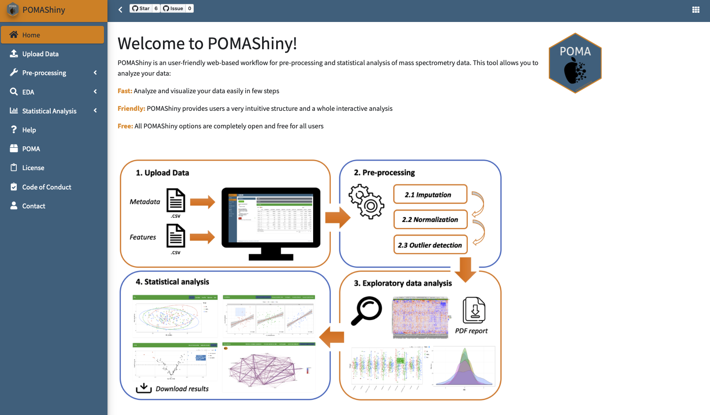

```{r setup, include = FALSE}
stopifnot(require(htmltools))
stopifnot(require(knitr))
```

```{r htmltools, include = FALSE}
htmltools::tagList(rmarkdown::html_dependency_font_awesome())

opts_chunk$set(warning = FALSE, message = FALSE, 
               comment = "#>", fig.path = 'img/', fig.align = 'center', 
               fig.height = 8.5, out.width = '100%', fig.show = 'hold', 
               fig.retina = 3, cache = FALSE, cache.path = 'cache/')
```

# Scope

.center[

### `POMA` focuses on <u>**statistical analysis**</u> of omics data

]

--

  1) Directly from sheet (xlsx, csv, etc.) &#10060;&#10060;
  
--
  
  2) Extract quantitative data from Bioconductor objects (`MSnSet`, `QFeatures`, `SummarizedExperiment`, etc.) and format it &#10060;

.footnote2[

Laurent Gatto, Omics Data Analysis; Chapter 8. [[Book]](https://uclouvain-cbio.github.io/WSBIM2122/sec-prot.html) </br>
Computational Biology Reading Group, Session 8. [[Project]](https://github.com/dukecct/CBRG/blob/main/inst/projects/08_project.Rmd) [[Slides]](https://github.com/dukecct/CBRG/blob/main/inst/slides/08_slides.Rmd) 

]

--

  3) Use Bioconductor objects directly (++ reproducibility and interoperability) &#9989;
  
</br>

.center[


]

---

# Data formatting

.center[

### Input required in all `POMA` functions is a `SummarizedExperiment` object

]

.pull-left[

**Target** - `colData()`


]

.pull-right[

**Features** - `assay()`


]

<br>

```{r, eval = FALSE}
# create SummarizedExperiment object from data frames
my_sum_exp <- PomaSummarizedExperiment(tatget = "target", 
                                       features = "features")
```

---

# Pre-processing...

.center[

### `POMA` pre-processing functions return a pre-processed `SummarizedExperiment` object

]

--

## Missing value imputation

```{r, eval = FALSE}
my_sum_exp %>% 
  PomaImpute(ZerosAsNA = FALSE, # treat zeros as zeros
             RemoveNA = TRUE, # remove features with...
             cutoff = 20, # more than 20% of NAs
             method = "knn") # up to 6 methods here!
```

--

## Normalization

```{r, eval = FALSE}
my_sum_exp %>% 
  PomaNorm(method = "log_scaling") # up to 6 methods here!
```

---

# Some more pre-processing...

## Outlier detection and cleaning

.pull-left[

**Detection**:

```{r, eval = FALSE}
my_sum_exp %>% 
  {{PomaOutliers(do = "analyze")}}
```

Output:

```{r, echo = FALSE, warning = FALSE, comment = FALSE, message = FALSE, fig.height = 4}
library(POMA)
library(ggplot2)
library(patchwork)

my_sum_exp <- st000284 %>% 
  PomaNorm(method = "log_scaling") %>%
  PomaOutliers(do = "analyze")

my_sum_exp$polygon_plot + theme(legend.position = "top") | 
  my_sum_exp$distance_boxplot + theme(legend.position = "top")
```

]

.pull-right[

**Cleaning**:

```{r, eval = FALSE}
my_sum_exp %>% 
  {{PomaOutliers(do = "clean")}}
```

Output:

A "clean" `SummarizedExperiment` object (without sample outliers)

]

---

# `SummarizedExperiment` subsetting

```{r, echo = FALSE}
st000284 %>% 
  PomaImpute(method = "knn")
```

--

```{r, echo = FALSE}
clean_object <- st000284[, st000284$factors %in% c("CRC", "Healthy")]

clean_object <- clean_object %>% 
  PomaImpute(method = "knn") %>% 
  PomaNorm(method = "log_scaling") %>% 
  PomaOutliers(do = "clean")
```

```{r, eval = FALSE}
clean_object[, clean_object$group %in% c("CRC", "Healthy")]
```

```{r, echo = FALSE}
clean_object
```

---

# Let's explore the data before stats!

## Samples

.pull-left[

```{r, warning = FALSE, comment = FALSE, message = FALSE, fig.height = 4}
clean_object %>%
  PomaBoxplots(group="samples", #<<
               label_size=5)
```

]

.pull-right[

```{r, warning = FALSE, comment = FALSE, message = FALSE, fig.height = 4}
clean_object %>%
  PomaDensity(group="samples") #<<
```

]

---

# Let's explore the data before stats!

## Features

.pull-left[

```{r, warning = FALSE, comment = FALSE, message = FALSE, fig.height = 4}
clean_object %>%
  PomaBoxplots(group="features", #<<
               label_size=5)
```

]

.pull-right[

```{r, warning = FALSE, comment = FALSE, message = FALSE, fig.height = 4}
clean_object %>%
  PomaDensity(group="features") #<<
```

]

---

# Features of interest

```{r, warning = FALSE, comment = FALSE, message = FALSE, fig.height = 3.4}
clean_object %>%
  PomaBoxplots(group = "features", 
               jitter = TRUE,
               legend_position = "right",
               feature_name = c("glyceraldehyde", 
                                "lysine", 
                                "linolenic_acid")) #<<
```

---

# Heatmap (with `ComplexHeatmap`)

```{r, warning = FALSE, comment = FALSE, message = FALSE, fig.height = 4}
clean_object %>%
  PomaHeatmap()
```

---

# Volcano plot

```{r, eval = FALSE}
clean_object %>%
    PomaVolcano(xlim = 2,
              log2FC = 0.5,
              labels = TRUE)
```

```{r, warning = FALSE, comment = FALSE, message = FALSE, fig.height = 4, echo = FALSE}
clean_object2 <- st000284[, st000284$factors %in% c("CRC", "Healthy")]

clean_object2 %>% 
  PomaImpute(method = "knn") %>%
  PomaOutliers(do = "clean") %>%
  PomaVolcano(xlim = 2,
              log2FC = 0.5,
              labels = TRUE)
```

---

# POMA workflow: 4) Statistical analysis

#### Statistical methods covered by `POMA`:

--

  - **Univariate analysis:** T-test, ANOVA, ANCOVA, Wilcoxon test, and Kruskal Wallis

--

  - **Multivariate analysis:** PCA, PLS-DA, and sPLS-DA

--

  - **Cluster analysis:** _k_-means (clusters projected in a MDS plot)

--

  - **Limma:** Both designs with and without covariates (from `limma` _Bioconductor_ package)

--

  - **Correlation analysis:** Pairwise correlations, correlogram, network correlations and Gaussian Graphical Models

--

  - **Regularization methods:** LASSO, Ridge, and Elasticnet (**allow train/test split**)

--

  - **Random forest:** Classical Random forest algorithm (**allow train/test split**)

--

  - **Rank products:** From `RankProd` _Bioconductor_ package

--

  - **Odds ratios:** Based on a logistic regression model (two-group analysis)

---

# POMA workflow: 4) Statistical analysis

.center[
All `POMA` functions are focused on <u>**simplifying and compacting**</u> the analyses, grouping different methodologies of the same class within a single function instead of maintaining many "single purpose" functions
]

--

.pull-left[

**Univariate analysis: 1 function, 4 methods**

```{r, warning = FALSE, comment = FALSE, message = FALSE, eval = FALSE}
clean_object %>%
  
# parametric methods
PomaUnivariate(method = "ttest")

PomaUnivariate(method = "anova")

# non-parametric methods
PomaUnivariate(method = "mann")

PomaUnivariate(method = "kruskal")
```

]

--

.pull-right[

**Multivariate analysis: 1 function, 3 methods**

```{r, warning = FALSE, comment = FALSE, message = FALSE, eval = FALSE}
clean_object %>% 
  
PomaMultivariate(method = "pca")

PomaMultivariate(method = "plsda")

PomaMultivariate(method = "splsda")
```

]

---

# POMA workflow: 4) Statistical analysis

.center[
`POMA` predictive features allow users to split data into random _train_ and _test_ sets in order to perform an <u>**external cross-validation**</u> (CV)
]

--

.pull-left[

LASSO for **feature selection**: All data used to create the model and no _test_ set created 

```{r, warning = FALSE, comment = FALSE, message = FALSE, eval = FALSE}
clean_object %>%
  PomaLasso(alpha = 1, # LASSO
            ntest = NULL) #<<
```

Ridge regression for **predictive modeling**: External CV using the 20% of the data as _test_ set

```{r, warning = FALSE, comment = FALSE, message = FALSE, eval = FALSE}
clean_object %>%
  PomaLasso(alpha = 0, # Ridge
            ntest = 20) #<<
```

]

--

.pull-right[

Random forest for **predictive modeling**: External CV using the 20% of the data as _test_ set

```{r, warning = FALSE, comment = FALSE, message = FALSE, eval = TRUE, echo = FALSE}
rf_res <- st000284 %>%
  PomaNorm(method = "log_scaling") %>%
  PomaRandForest(ntest = 20)
```

```{r, warning = FALSE, comment = FALSE, message = FALSE, eval = FALSE}
clean_object %>%
  PomaRandForest(ntree = 500,
                 ntest = 20) #<<
```

```{r, warning = FALSE, comment = FALSE, message = FALSE, eval = TRUE, echo = FALSE}
kableExtra::kbl(rf_res$confusion_matrix, booktabs = TRUE) %>%
  kableExtra::kable_styling(latex_options = c("striped", "scale_down"))
```

]

---

# POMA workflow: 4) Statistical analysis

**"Top-down" example: From raw data to _limma_ model adjusted for covariates**

```{r, echo = FALSE, warning = FALSE, comment = FALSE, message = FALSE}
poma_results <- st000284 %>% 
  PomaImpute(method = "knn") %>%
  PomaNorm(method = "log_scaling") %>% 
  PomaOutliers(do = "clean") %>%
  PomaLimma(contrast = "CRC-Healthy", covariates = TRUE)
```

```{r, warning = FALSE, comment = FALSE, message = FALSE, eval = FALSE}
raw_MSnSet_data %>% 
  PomaImpute(method = "knn") %>%
  PomaNorm(method = "log_scaling") %>% 
  PomaOutliers(do = "clean") %>%
  PomaLimma(contrast = "CRC-Healthy", covariates = TRUE) #<<
```

```{r, echo = FALSE, warning = FALSE, comment = FALSE, message = FALSE}
kableExtra::kbl(poma_results[1:5 ,], booktabs = TRUE) %>%
  kableExtra::kable_styling(latex_options = c("striped", "scale_down"))
```

---

# POMAShiny

.center[

]

<a href="https://github.com/pcastellanoescuder/POMAShiny"><i class="fab fa-github"></i>&nbsp; https://github.com/pcastellanoescuder/POMAShiny</a>
<br>
<a href="https://webapps.nutrimetabolomics.com/POMAShiny"><i class="fas fa-link"></i>&nbsp; https://webapps.nutrimetabolomics.com/POMAShiny</a>

---

# Summary

--

.font130[
  - POMA provides a <span style="color:#f38620">**robust**</span>, <span style="color:#f38620">**reproducible**</span>, and <span style="color:#f38620">**user-friendly**</span> workflow for the statistical analysis of metabolomics and proteomics data
]

--

.font130[
  - POMA allows users to include different <span style="color:#f38620">**covariates**</span> in the analysis
]

--

.font130[
  - POMA also provides its own interactive Shiny version called <span style="color:#f38620">**POMAShiny**</span>
]

--

.font130[
  - POMA is an <span style="color:#f38620">**open source**</span> tool and everybody is <span style="color:#f38620">**welcome to contribute**</span>!
]

